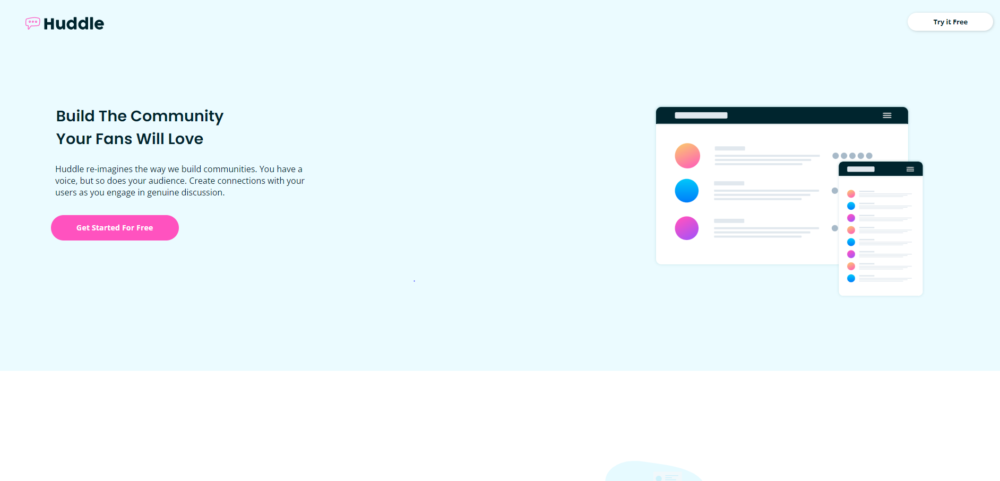

# Frontend Mentor - Huddle landing page with alternating feature blocks solution

This is a solution to the [Huddle landing page with alternating feature blocks challenge on Frontend Mentor](https://www.frontendmentor.io/challenges/huddle-landing-page-with-alternating-feature-blocks-5ca5f5981e82137ec91a5100). Frontend Mentor challenges help you improve your coding skills by building realistic projects. 

## Table of contents

- [Overview](#overview)
  - [The challenge](#the-challenge)
  - [Screenshot](#screenshot)
  - [Links](#links)
- [My process](#my-process)
  - [Built with](#built-with)
  - [What I learned](#what-i-learned)
  - [Continued development](#continued-development)
  - [Useful resources](#useful-resources)
- [Author](#author)
- [Acknowledgments](#acknowledgments)

**Note: Delete this note and update the table of contents based on what sections you keep.**

## Overview

### The challenge

Users should be able to:

- View the optimal layout for the site depending on their device's screen size
- See hover states for all interactive elements on the page

### Screenshot




### Links

- Solution URL: [Check out the code](https://huddle-landing-page-with-alternating-feature-block-thecoderguru.vercel.app/)
- Live Site URL: [Visit the live site here](https://github.com/TheCoderGuru/huddle-landing-page-with-alternating-feature-block.git)

## My process

### Built with

- Semantic HTML5 markup
- CSS custom properties
- CSS Grid
- Mobile-first workflow


### What I learned

Throughout doing this challenge, I learnt how to structure my html markup as per the mobile design to make it easier to code, in addition to learning the css grid property ```order:1```.


### Continued development

I plan to continue using css grid where content on a webpage needs to be aligned on both the x and y axis in addition to exploring more css grid properties to become a bit more familiar


### Useful resources

- [CSS Tricks - CSS Grid](https://css-tricks.com/snippets/css/complete-guide-grid/) - This helped me with the flexbox concept and I am really glad to be recommend this article, will use it going forward.

- [MDN CSS Reference](https://developer.mozilla.org/en-US/docs/Web/CSS) - This is the guide to all the css properties with an indept explanation. Definitely recommend it.


## Author

- Frontend Mentor - [@TheCoderGuru](https://www.frontendmentor.io/profile/TheCoderGuru)
- Twitter - [@TheCoderGuru](https://www.twitter.com/TheCoderGuru)


## Acknowledgments

[Christopher-Adolphe](https://www.frontendmentor.io/profile/Christopher-Adolphe) for this detailed and well structured feedback which helped me to finish this challenge as close to the design as possible.

[Danilo Blas](https://www.frontendmentor.io/profile/Sdann26) for his wonderful suggestion to incorporate a box-shadow on the grid containers in addition to making the footer clickcs clickable.

